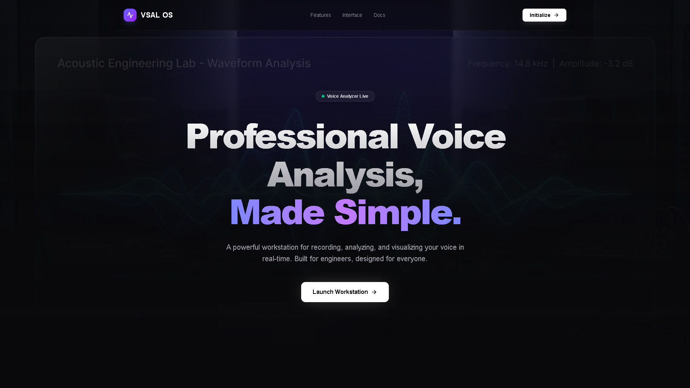
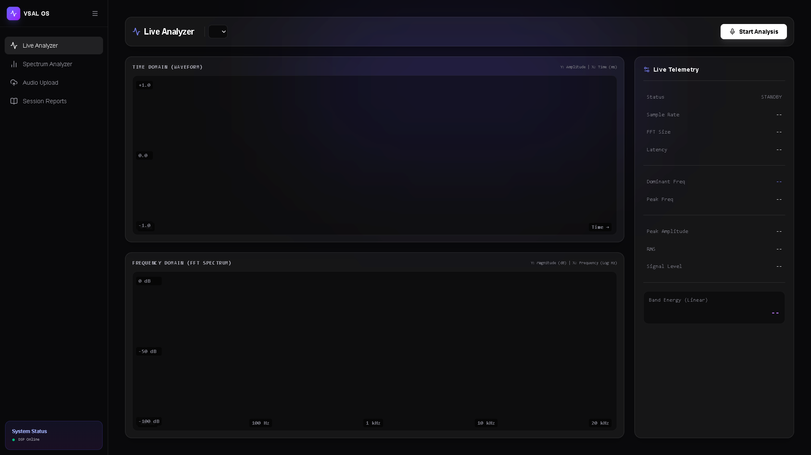

# 🎙️ Voice Signal Analysis Laboratory

Welcome to the **Voice Signal Analysis Laboratory**! This is a state-of-the-art web application designed for real-time acoustic telemetry, voice analysis, and signal processing.



## 🚀 Features

*   **Real-Time Spectrum Analyzer:** Visualize audio frequencies instantly with zero-latency digital signal processing (DSP).
*   **Information Theory Lab:** Capture and record sessions to view rich, detailed analytical reports including Maximum Peak Frequency, Acoustic Entropy, and Energy Band distributions.
*   **Aesthetic UI/UX:** Built with a stunning dark-mode-first design, glassmorphism elements, and smooth micro-animations.
*   **Audio Upload & Processing:** Upload your own audio files for deep static analysis.



## 🛠️ Tech Stack

*   **Frontend:** React, TypeScript, Vite
*   **Styling:** Tailwind CSS, Lucide React Icons
*   **Audio Processing:** Web Audio API (AnalyserNode, MediaStream)

## 💻 Getting Started

To run this project locally on your machine:

1.  **Clone the repository**
    ```bash
    git clone https://github.com/Gowtham-Sai-9644/Voice-Signal-Analysis-Laboratory.git
    cd Voice-Signal-Analysis-Laboratory/frontend
    ```
2.  **Install dependencies**
    ```bash
    npm install
    ```
3.  **Run the development server**
    ```bash
    npm run dev
    ```

---
*Built with precision and high-performance audio telemetry in mind.*
